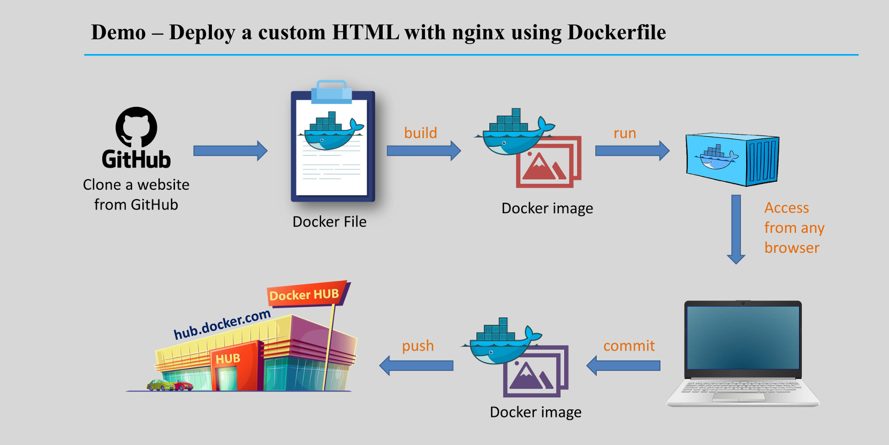
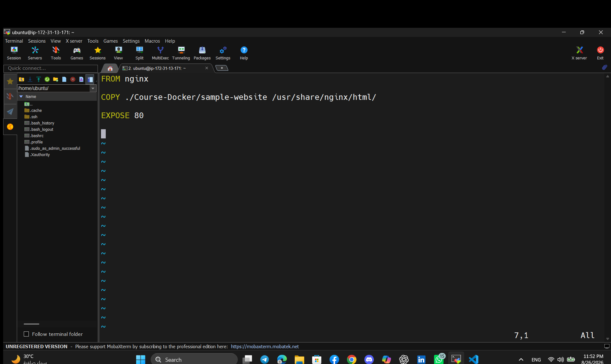
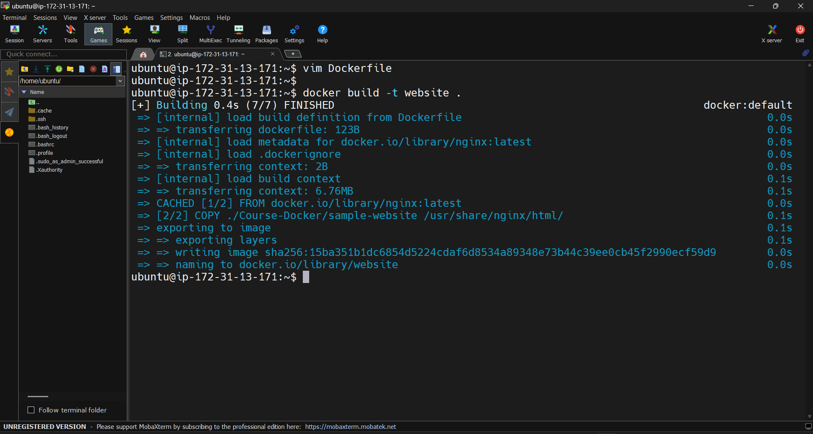
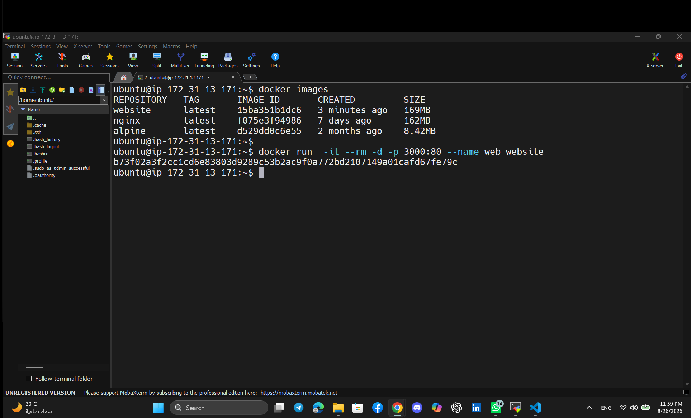
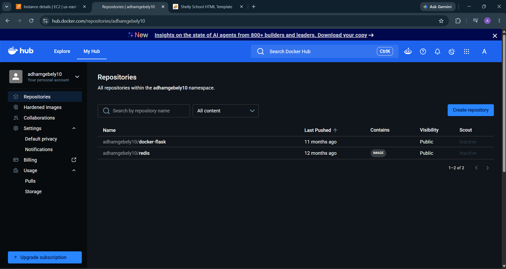
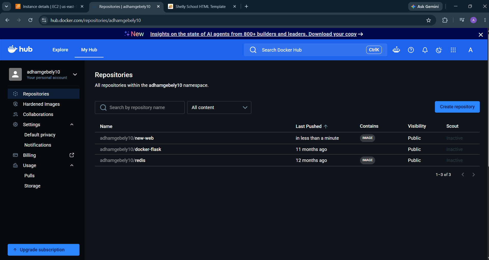

# 🚀 Nginx Website with Docker

<p align="center">
  
  
  
</p>

A practical **DevOps project** demonstrating how to deploy a static website using **Nginx inside a Docker container**, expose it through a host port, and publish the Docker image to **Docker Hub**.

The project demonstrates the complete workflow:

```text
GitHub → Dockerfile → Docker Image → Docker Container → Browser → Docker Hub
```

---

# 📌 Architecture

<p align="center">
  
</p>

The project workflow is:

1. Clone the website source code.
2. Create an Nginx Docker image.
3. Copy the static website files into Nginx.
4. Build the Docker image.
5. Run a Docker container.
6. Map container port `80` to host port `3000`.
7. Open the website from the browser.
8. Push the Docker image to Docker Hub.

---

# 🛠 Technologies Used

* Docker
* Nginx
* Linux / Ubuntu
* Git
* GitHub
* Docker Hub
* HTML
* CSS
* JavaScript

---

# ✅ Prerequisites

Before starting, make sure **Git** and **Docker** are installed.

Check Git:

```bash
git --version
```

Check Docker:

```bash
docker --version
```

Check that Docker is running:

```bash
docker info
```

---

# 📥 Clone the Repository

Clone this repository:

```bash
git clone https://github.com/adhamgebely/nginx-website.git
```

Move into the project:

```bash
cd nginx-website
```

---

# 📥 Clone the Sample Website

The Dockerfile expects the website files to exist inside:

```text
Course-Docker/sample-website
```

Clone the sample website source used in the project.

<p align="center">
  
</p>

---

# 🐳 Dockerfile

The project uses the official **Nginx Docker image**.

```dockerfile
FROM nginx

COPY ./Course-Docker/sample-website /usr/share/nginx/html/

EXPOSE 80
```

<p align="center">
  
</p>

## Dockerfile Explanation

| Instruction  | Description                                                  |
| ------------ | ------------------------------------------------------------ |
| `FROM nginx` | Uses the official Nginx image                                |
| `COPY`       | Copies the static website files into the Nginx web directory |
| `EXPOSE 80`  | Exposes HTTP port `80`                                       |

The Nginx default website directory is:

```text
/usr/share/nginx/html/
```

---

# 🏗 Build the Docker Image

Build the Docker image and name it:

```text
website
```

Run:

```bash
docker build -t website .
```

After the build finishes, check the available images:

```bash
docker images
```

<p align="center">
  
</p>

---

# ▶️ Run the Docker Container

Run the Docker image as a container:

```bash
docker run -it --rm -d -p 3000:80 --name web website
```

## Command Explanation

| Option       | Description                                        |
| ------------ | -------------------------------------------------- |
| `-it`        | Allocates an interactive terminal                  |
| `--rm`       | Automatically removes the container after it stops |
| `-d`         | Runs the container in detached mode                |
| `-p 3000:80` | Maps host port `3000` to container port `80`       |
| `--name web` | Sets the container name to `web`                   |
| `website`    | Docker image name                                  |

Check the running container:

```bash
docker ps
```

<p align="center">
  
</p>

---

# 🌐 Open the Website

If Docker is running locally, open:

```text
http://localhost:3000
```

If Docker is running on a remote server or cloud VM:

```text
http://YOUR_SERVER_PUBLIC_IP:3000
```

For example:

```text
http://SERVER_IP:3000
```

> If you are using AWS EC2 or another cloud provider, make sure inbound TCP traffic on port `3000` is allowed.

<p align="center">
  
</p>

---

# 📋 Useful Docker Commands

## Show Running Containers

```bash
docker ps
```

## Show All Containers

```bash
docker ps -a
```

## Show Docker Images

```bash
docker images
```

## View Container Logs

```bash
docker logs web
```

## Follow Container Logs

```bash
docker logs -f web
```

## Enter the Running Container

```bash
docker exec -it web /bin/bash
```

## Stop the Container

```bash
docker stop web
```

Because the container was started using:

```text
--rm
```

Docker will automatically remove the container after it stops.

---

# ☁️ Push the Image to Docker Hub

The Docker Hub repository used in this project is:

```text
adhamgebely10/new-web
```

## Docker Hub Before Push

<p align="center">
  
</p>

---

## Login to Docker Hub

```bash
docker login
```

Enter your Docker Hub username and password when prompted.

---

## Tag the Docker Image

```bash
docker tag website:latest adhamgebely10/new-web:latest
```

Check the images:

```bash
docker images
```

---

## Push the Image

```bash
docker push adhamgebely10/new-web:latest
```

---

# ✅ Docker Hub After Push

<p align="center">
  
</p>

The Docker image is now available on Docker Hub.

---

# 📦 Pull the Image from Docker Hub

Any machine with Docker installed can download the image using:

```bash
docker pull adhamgebely10/new-web:latest
```

Check the downloaded image:

```bash
docker images
```

---

# ▶️ Run the Image from Docker Hub

Run the downloaded image:

```bash
docker run -it --rm -d -p 3000:80 --name web adhamgebely10/new-web:latest
```

Then open:

```text
http://localhost:3000
```

If running on a remote server:

```text
http://YOUR_SERVER_PUBLIC_IP:3000
```

---

# ⚡ Complete Command Flow

Here is the full workflow for quick copy and paste.

## Clone

```bash
git clone https://github.com/adhamgebely/nginx-website.git
```

## Enter Project

```bash
cd nginx-website
```

## Build Image

```bash
docker build -t website .
```

## Check Images

```bash
docker images
```

## Run Container

```bash
docker run -it --rm -d -p 3000:80 --name web website
```

## Check Container

```bash
docker ps
```

## Login to Docker Hub

```bash
docker login
```

## Tag Image

```bash
docker tag website:latest adhamgebely10/new-web:latest
```

## Push Image

```bash
docker push adhamgebely10/new-web:latest
```

## Pull Image

```bash
docker pull adhamgebely10/new-web:latest
```

## Run Docker Hub Image

```bash
docker run -it --rm -d -p 3000:80 --name web adhamgebely10/new-web:latest
```

---

# 🧹 Cleanup

## Stop Container

```bash
docker stop web
```

## Remove Container

If needed:

```bash
docker rm -f web
```

## Remove Local Image

```bash
docker rmi website
```

## Remove Docker Hub Image Tag Locally

```bash
docker rmi adhamgebely10/new-web:latest
```

## Remove Unused Docker Resources

```bash
docker system prune
```

Docker will ask for confirmation before deleting unused resources.

---

# 📁 Project Structure

```text
nginx-website/
│
├── Dockerfile
├── README.md
│
└── screenshots/
    ├── Architecture.png
    ├── Dockerfile.png
    ├── browser.png
    ├── build-image.png
    ├── docker-run.png
    ├── dockerhub-after-push.png
    ├── dockerhub-before-push.png
    └── git clone.png
```

---

# 🔧 Troubleshooting

## Port 3000 Is Already in Use

If port `3000` is already being used, use another port.

For example:

```bash
docker run -it --rm -d -p 8080:80 --name web website
```

Then open:

```text
http://localhost:8080
```

---

## Container Name Already Exists

If Docker returns an error saying that the container name `web` already exists:

```bash
docker rm -f web
```

Then run the container again:

```bash
docker run -it --rm -d -p 3000:80 --name web website
```

---

## Check Container Status

```bash
docker ps
```

For stopped containers:

```bash
docker ps -a
```

---

## Check Container Logs

```bash
docker logs web
```

---

## Check Port Mapping

```bash
docker port web
```

Expected output should show port `80` mapped to port `3000`.

---

## Website Cannot Be Opened on a Remote Server

Make sure:

* The container is running.
* Port `3000` is published.
* The server firewall allows port `3000`.
* The cloud security group allows inbound TCP traffic on port `3000`.

Check the container:

```bash
docker ps
```

---

# 🎯 Learning Objectives

By completing this project, you will understand how to:

* Build Docker images.
* Write a Dockerfile.
* Use Nginx inside Docker.
* Serve a static website using Nginx.
* Run Docker containers.
* Map host ports to container ports.
* Manage Docker containers.
* View Docker logs.
* Tag Docker images.
* Push images to Docker Hub.
* Pull images from Docker Hub.
* Deploy containerized applications on remote servers.

---

# 👨‍💻 Author

**Adham Gebely**

GitHub:

```text
https://github.com/adhamgebely
```

Repository:

```text
https://github.com/adhamgebely/nginx-website
```

---

# ⭐ Support

If you found this project useful, consider giving the repository a **Star ⭐**.

Happy Dockerizing! 🐳
